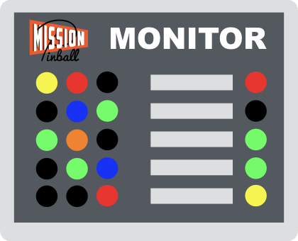

MPF Monitor (mpf-monitor)
=========================

This package is for Mission Pinball Framework (MPF) Monitor
(mpf-monitor).

The MPF monitor is a graphical app that connects to a live running
instance of MPF and shows the status of various devices. (LEDs,
switches, ball locks, etc.). You can add a picture of your playfield and
drag-and-drop devices to their proper locations so you can interact with
your machine when you're not near your physical machine.

The MPF Monitor can run on Windows, Mac, and Linux. It uses PyQt5
(Python bindings for Qt5) for its visual framework.

Installation & Instructions
---------------------------

Full instructions for installing and using the MPF monitor are included
in the MPF documentation here:

http://docs.missionpinball.org/en/latest/tools/monitor

**Note:** MPF Monitor requires PyQt5. There is a Python package for
Python 3.5 which will be installed automatically if you're using Python
3.5. If you're using Python 3.4, you will need to download and install
PyQt5 manually. See the installation instructions in the link above for
details.

License
-------
* MPF and the MPF Monitor are released under the terms of the MIT
  License. Please refer to the LICENSE file for details.
* The MIT license basically means you can do anything you want with MPF,
  including using it for commercial projects. You don't have to pay us
  or share your changes if you don't want to.
